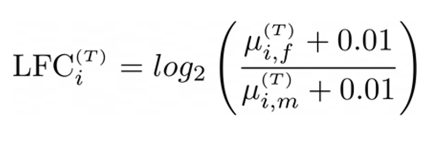
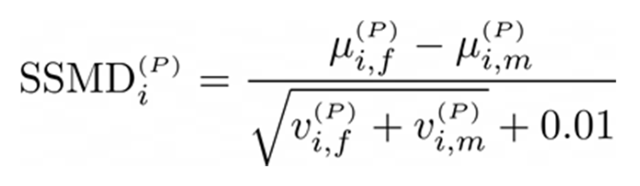
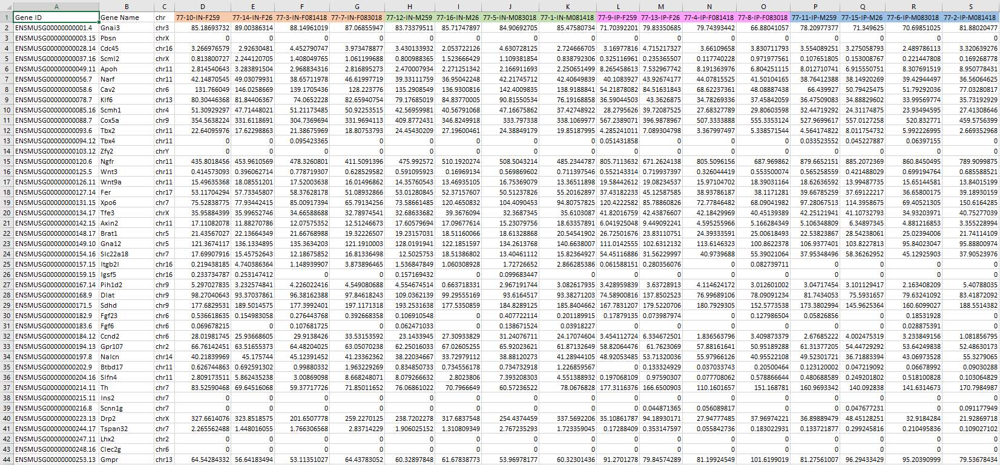
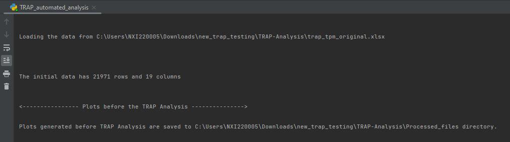
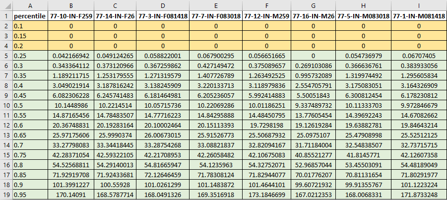
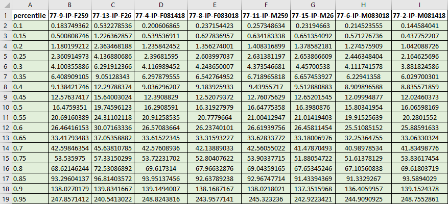
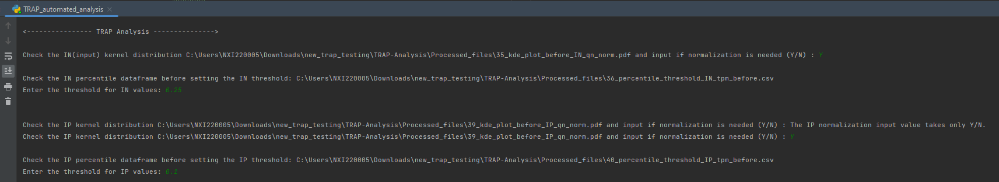
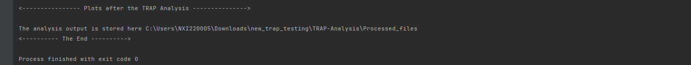
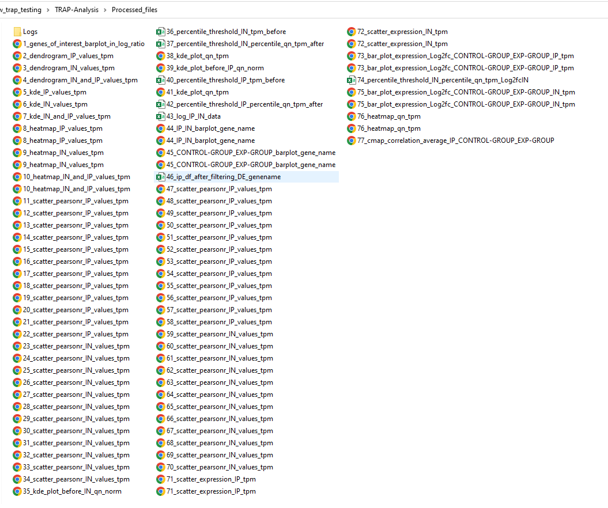

# TRAP Analysis Tool

Translating Ribosome Affinity Purification (TRAP) allows the characterization of mRNAs associated with ribosomes in a cell-specific manner. GFP-tagged ribosomal proteins are expressed in specific cells (e.g. Nav1.8+ neurons). The tagged ribosomal proteins are purified and the RNA isolated and processed for sequencing. Here we provide a tool to analyze TRAP sequencing datasets. This pipeline has been used in this study: [Diana Tavares-Ferreira](https://scholar.google.com/citations?user=e8x4Z04AAAAJ&hl=pt-PT), [Pradipta R. Ray](https://scholar.google.com/citations?user=1Uynk5gAAAAJ&hl=en), [Ishwarya Sankaranarayanan](https://scholar.google.com/citations?user=gO-CrFYAAAAJ&hl=en), Galo L. Mejia, [Andi Wangzhou](https://scholar.google.com/citations?user=TrS1lyUAAAAJ&hl=en), Stephanie Shiers, Ruta Uttarkar, Salim Megat, [Paulino Barragan-Iglesias](https://scholar.google.com/citations?user=-xkF064AAAAJ&hl=es), [Gregory Dussor](https://scholar.google.com/citations?user=PTGw47kAAAAJ&hl=en), [Armen N. Akopian](https://scholar.google.com/citations?user=0-ah3oUAAAAJ&hl=en), [Theodore J. Price](https://scholar.google.com/citations?user=CoXdJw0AAAAJ&hl=en) (2022). Sex differences in nociceptor translatomes contribute to divergent prostaglandin signaling in male and female mice. [Biological Psychiatry, 91(1), 129-140](DOI:https://doi.org/10.1016/j.biopsych.2020.09.022), in this study, we examined the transcriptome and translatome of the mouse DRG with the goal of identifying sex differences.

## Installation/Setup of TRAP Analysis Tool:

You can install TRAP Analysis tool via git:
```
git clone https://github.com/utdal/TRAP-Analysis.git
```

## Functionalities:
1. TRAP - QC checks
2. TRAP analysis
   1. IN (Input) Analysis
      1. IN percentile calculation and clean-up 
      2. IN normalization
      3. IN SSMD calculation
   2. IP (or TRAP) Analysis
      1. IP percentile calculation and clean-up 
      2. IP normalization
      3. IP SSMD calculation
3. Calculation of BC-distance and Log2FC statistics for IN and IP
4. Plotting Differentially expressed genes

Note:
> INPUT (IN): Fraction that corresponds to total RNA from all cells in the tissue.
> 
> IP (or TRAP): Fraction that corresponds to mRNAs associated with ribosomes in cell of interest (in this case Nav1.8+ DRG neurons).

All the methods utilized in this analysis tool are logged with appropriate logging mechanisms.

## Details about each functionality:
##### 1. TRAP - QC checks

   As part of the QC checks, there are multiple charts which the tool plots:
   1. IN & IP histogram specifically for the genes of interest
   2. Dendrogram charts among IN & IP, and across IN & IP
   3. Density distribution plots for all the samples (IN & IP)
   4. Heatmaps among IN & IP and across IN & IP
   5. Scatter distribution to check the pearson coefficient

##### 2. TRAP Analysis
   1. IN (Input) Analysis
      1. IN percentile calculation for with 5% intervals based on the distribution of the data
      2. Quantile normalization of IN data(optional)
      3. Calculation of SSMD statistic for IN data
      4. Filtering out the data based on IN percentile calculation(genes detected in IN)
   2. IP (or TRAP) Analysis
      1. IP percentile calculation for with 5% intervals based on the distribution of the data
      2. Quantile normalization of IP data(optional)
      3. Calculation of SSMD statistic for IP data
      4. Filtering out the data based on IP percentile calculation(genes detected in IP or TRAP)
   
3. Calculation of BC-distance, SSMD and Log2FC statistics for IN and IP
   - Log2-fold change: 
   
     Calculation of log2-fold change (based on median TPMs) for each consistently transcriptome-expressed coding gene in the IN, and for each consistently translatome- expressed coding gene in the IP. 
     > Here is how it is calculated;
       
     , where for gene i, LFC(T)i is the log2-fold change, μ(T)i,f and μ(T)i,m are the median TPMs in females and males respectively, with 0.01 as the smoothing factor.

   - Strictly standardized mean difference (SSMD):
     > Strictly standardized mean difference (SSMD) is used to discover genes with systematically altered expression percentile ranks between males and females. SSMD is the difference of means controlled by the variance of the sample measurements. We used SSMD as a measure of effect size since it is appropriate for smaller sample sizes while simultaneously controlling for within-group variability. It is calculated as follows:  
     
     , where for gene i, SSMD(P)i is the strictly standardized mean difference, with μ(P)i,f , v(P)i,f and μ(P)i,m , v(P)i,f are the means and variances of gene TPM percentile ranks in females and males respectively, under the assumption that covariance is 0, and with 0.01 as the smoothing factor.
   
   - Bhattacharyya distance (BC-distance):
   
      Here Bhattacharyya distance(BC-distance), is used to calculate the amount of overlap in the area under the curve of the two sample distributions (corresponding to each sex) in order to identify the best candidates for the DE genes.

### How does the input look like...
   The tool requires a **.xlsx/.csv** file with `TPM's`, `Gene ID` and `Gene Name` columns as shown below:
   

### Running TRAP Analysis Tool
There are 2 ways to run the TRAP Analysis Tool, however for both the cases one needs to install the required python packages to a new python environment. Python environments can be created using `conda` or manually using python `venv` as shown below:

> Note: It is recommended to have python version of 3.7. Checking python version: `python --version`

#### 1. Creating a python environment using python `venv`
`python --m venv /path/to/new/virtual/env`
Loading the envonrment(`venv`) created:
> Windows - `Drive:/path/to/new/virtual/env/activate.bat`

> Linux/MacOS - `source /path/to/new/virtual/env/activate`

#### 2. Creating a python environment using `conda venv`
Here a new environment called *conda_venv* is created with python version(3.9)
`conda create -n conda_venv python=3.9`

Loading the conda environment (`conda_venv`) created:
> `conda activate conda_venv`

#### 3. Installing all the python packages
There is a `requirements.txt` file in this directory to set-up all the necessary python packages for this tool. Use the below command to install all the packages:
> `pip install -r requirement.txt`


#### 4. Running the Tool
Here is an example of how we run the tool:

1. Modifying the input data accordingly in the *TRAP_automated_analysis.py*
   ```
    # define the list of groups for IN and IP samples: group1-in and group2-ip
    group1_in_list = ['77-10-IN-F259',	'77-14-IN-F26',	'77-3-IN-F081418',	'77-7-IN-F083018']
    group1_ip_list = ['77-9-IP-F259',	'77-13-IP-F26',	'77-4-IP-F081418',	'77-8-IP-F083018']
    group2_in_list = ['77-12-IN-M259',	'77-16-IN-M26',	'77-5-IN-M083018',	'77-1-IN-M081418']
    group2_ip_list = ['77-11-IP-M259',	'77-15-IP-M26',	'77-6-IP-M083018',	'77-2-IP-M081418']
   
    # genes of interest
    gene_id_list = ['Mrgprd', 'Calcb', 'Scn10a', 'Calca', 'Trpv1', 'Prph', 'Prdm12', 
                    'Cx3cr1', 'Aif1', 'Aldh1l1', 'Cldn5', 'Mpz', 'Mbp', 'Gfap']
   
    # sample names (used in plots and percentile calculations) 
    sample_name_list = ['IP_values', 'IN_values', 'IN_and_IP_values']
    group_name_list = ['Exp-Group', 'Control-Group']  # [ group2, group1 ] or [ Experimental Group, Control Group ]
    
    tpm_filepath = r"C:\Users\NXI220005\Downloads\new_trap_testing\TRAP-Analysis\trap_tpm_original.xlsx"
   ```
 
2. Running the tool using python command-line, once the necessary environment is loaded: 
   `python TRAP_automated_analysis.py`
   
3. Using PyCharm, right-click and run the file *TRAP_automated_analysis.py*

Note: For all the functionalities, the tool offers an interactive input mechanism during the run-time for the user to input.

##### Run: 
1. Plotting before TRAP Analysis


2. IN & IP percentile calculations

   - IN Percentile Calculation (IN threshold - 0.2>=)
   
   - IP Percentile Calculation (IP threshold - 0.0>=)
   

3. Select the appropriate filtering and normalization(Y-Yes/N-No) condition for IN samples from the IN threshold's as shown in the below screenshot: 

4. Select the appropriate filtering and normalization(Y/N) condition for IP samples from the IP threshold's as shown in the below screenshot: 

5. Statistical Analysis: Input the BC filter, SSMD filter and Lof2FC thresholds to calculate differentially expressed genes:
   > Note: These values are just for reference, please adjust to your data.
   
    | Filter      | Value |
    |-------|-------|
    | BC filter   | 0.5   |
    | SSMD filter | 0.97  |
    | Log2FC      | 1.33  |

6. At this step the analysis is complete and results are stored in 

   Further analysis can be done using the processed files(.csv files) as shown in the below screenshort:
   


### Output
The output is predominantly image PDF's & .csv files which are stored in `/Processed_files` directory.

### License
License information can be found in the LICENSE file.
